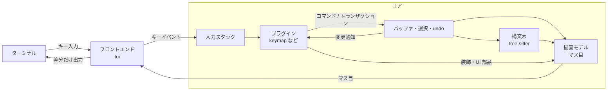

# アーキテクチャ

> ステータス: 草案。末尾の「要確認」は未決。

[vision.md](vision.md) の方針を、コアの構造に落とし込む。プラグイン API の具体的な形（WIT）は plugin-api.md で決める。

## 全体像

nib は 1 つのプロセスで動く。プラグインは wasmtime の上で、同じプロセス内のサンドボックスとして動く。外部プロセス（LSP サーバーなど）は、プラグインの依頼を受けてコアが起動する。

## クレート構成

| ディレクトリ | クレート | 役割 |
|--------------|----------|------|
| `core/` | `nib-core` | バッファ、選択、トランザクション、undo、構文木、描画モデル、コマンド、プラグインホスト |
| `tui/` | `nib-tui` | ターミナルとの入出力。実行ファイル `nib` を作る |
| `plugins/*` | `nib-plugin-*` | 標準プラグイン（`wasm32-wasip2` 向け） |

`nib-core` はターミナル関連のクレート（crossterm など）に依存しない。「何を表示するか」と「どう描くか」の分離を、クレートの依存関係で強制するため。

プラグインホスト（wasmtime）は、まず `nib-core` のモジュールとして持つ。ビルド時間が問題になったら別クレートに分ける。

## データモデル

### バッファ

- テキストは rope で持つ（ropey を想定）。複製が O(1) なので、後述の非同期処理にスナップショットを渡しやすい。
- UTF-8 のみ扱う。改行コード（LF / CRLF）は読み込み時に判定し、保存時に元に戻す。
- ファイルの読み込みと保存はコアの仕事。プラグインは `buffer.save` のようなコマンドを呼ぶだけで、ファイル権限は要らない。

### 位置

- 位置は **UTF-8 のバイトオフセット** で表す。
- 選択の端は、常に書記素クラスタ（見た目の 1 文字）の境界にあることをコアが保証する。

### 選択

- 選択は Helix と同じく、複数の範囲の集合で持つ。各範囲は `anchor` と `head` を持ち、`head` がカーソルの位置になる。常に 1 つ以上あり、そのうち 1 つを主選択とする。
- 選択はビューごとに持つ。同じバッファを 2 つの分割で開けば、選択も 2 組になる。
- vim 風の「カーソルだけ」の編集モデルは、幅 1 の選択として表す。**コアはモード（ノーマル・挿入など）を知らない。** モードはキーマッププラグインの内部状態で、コアに伝えるのはカーソルの形のような表示に必要な情報だけ。

### トランザクション

- バッファへの変更は、すべてトランザクション（変更の集合と、変更後の選択の組）として適用する。コアもプラグインも同じ道を通る。
- トランザクションは、作られた時点のバッファのバージョンを持つ。バージョンが古い場合は拒否する。LSP の整形結果のように、計算中にユーザーが編集した場合は捨てて構わない。
- 1 つのトランザクションはまとめて適用され、途中の状態を他のプラグインが見ることはない。

### undo

- 履歴はコアが持つ。どのプラグインの変更も、同じ履歴で取り消せるようにするため。
- まずは線形の履歴で始める。Helix のような undo ツリーは後で検討する。
- どこを 1 回の undo 単位にするかはプラグインが決める。たとえば挿入モードに入ってから出るまでを 1 単位にする。

### 装飾

- プラグインは、バッファ上の範囲に装飾（ハイライト、下線、行内に差し込む文字列、行頭の記号）を付けられる。
- 装飾の位置は、編集に合わせてコアが自動で動かす（Neovim の extmark に相当）。診断結果を出すプラグインは、編集のたびに位置を計算し直さなくてよい。

## 構文木

- tree-sitter の解析はコアが行う。編集のたびに、トランザクションの変更範囲を使って差分で解析し直す。
- 文法は WASM 形式のものをプラグインが提供し、ハイライトなどのクエリ（`.scm`）も同じプラグインが持つ。
- プラグインは API を通じて、構文ノードの検索やクエリの実行ができる。テキストオブジェクト（「関数を選択」など）はこれで実現する。
- M1 には含めない。

## コマンド

- コマンドは名前つきの操作（例: `buffer.save`、`helix.move_next_word`）で、コアとプラグインの両方が登録できる。
- プラグイン同士はコマンドの名前を通じて連携する。たとえば LSP プラグインが `lsp.goto_definition` を登録し、キーマッププラグインがそれを `gd` に割り当てる。プラグインが互いの中身に依存しないで済む。
- 引数と戻り値の形式は plugin-api.md で決める。

## 入力

- フロントエンドは、端末から受け取ったキーを、端末の種類に依存しない形（キーと修飾キーの組）に直してコアに渡す。kitty keyboard protocol が使える端末では使う。
- コアは**入力スタック**の上から順にキーを渡す。
  - いちばん下はキーマッププラグイン。
  - ファイル選択のようにキーを専有したいプラグインは、スタックに自分を積む。
  - 受け取ったプラグインが「処理しない」と返せば、下に回す。
- キー入力はすべてプラグインを経由するが、WASM の関数呼び出しは数マイクロ秒程度なので、遅延は問題にならない想定。実装後に測って確かめる。

## 描画

### 描画モデル

- コアは画面を**等幅文字のマス目**として組み立てる。各マスは文字（書記素クラスタ）とスタイル（前景色、背景色、太字など）を持つ。全角文字は 2 マスを使う。
- 組み立てに使うのは次のもの。
  - 表示範囲のテキスト
  - 構文ハイライト
  - プラグインが付けた装飾
  - UI 部品（後述）
  - カーソルの位置と形
- フロントエンドは、前回のマス目との差分だけを端末に書き出す。
- 書記素の分割や幅の計算は、表示中の行だけで行う。

### プラグイン API に画面の座標を出さない

プラグインが扱うのは、バッファ上の位置と、抽象的な UI 部品だけにする。「画面の何行目・何列目」は API に出さない。配置と切り詰めはコアが行う。こうしておけば、分割のレイアウトを変えても、あとから GUI を足しても、プラグインを書き直さずに済む。

### UI 部品

コアが用意する部品は、まず次の 3 つに絞る。

| 部品 | 用途の例 |
|------|----------|
| ステータスライン | モード表示、ファイル名、診断の件数。プラグインが左・中・右に区切った文字列を渡す |
| ポップアップ | 補完候補、ホバー。バッファ上の位置に結びつけて表示する |
| パネル | コマンドライン、ファイル選択。画面の下端など決まった場所に出す |

中身は、どれもスタイルつきの行の並びとして渡す。

### テーマ

プラグインは色を直接指定せず、`ui.statusline` や `diagnostic.error` のような名前で指定する。名前から色への対応はテーマが決める。

## プラグインの実行

### 1 本のスレッドで順に処理する

- コアのメインループは 1 本のスレッドで、次のイベントを順に処理する。
  - キー入力
  - 外部プロセスの出力
  - タイマー
  - ファイルの変更
- プラグインの呼び出しも同じスレッドで行う。変更の順序が 1 つに決まるので、競合を解決する仕組みが要らない。
- 一連のイベントを処理し終えたら、1 回だけ描画する。

プラグインを別スレッドで並行して動かす設計（xi-editor の方式）は採らない。編集の競合を解決する仕組みが必要になり、複雑さに見合わない。

### 待たせない

- プラグインは、時間のかかる処理を自分では待たない。外部プロセスの起動やファイル検索はコアに依頼し、結果はあとからイベントとして受け取る。
- LSP プラグインはこの形で書ける。サーバーへの送信をコアに依頼し、応答はイベントで受け取る。
- 1 回の呼び出しには時間の上限を設ける（wasmtime の epoch interruption を使う）。上限を超えたプラグインは停止して無効にし、エディタ自体は動き続ける。
- 重い計算（大量の候補のあいまい検索など）を別スレッドで回す仕組みは、必要になってから考える。rope のスナップショットを渡して読み取り専用で動かす形を想定している。

### 障害の切り離し

プラグインがトラップ（WASM の実行時エラー）を起こした場合は、そのインスタンスを捨ててエラーを表示する。プラグインがバッファを変えられるのはトランザクション経由だけなので、途中で落ちてもバッファは壊れない。

## プラグインの読み込み

- 設定ファイルは `~/.config/nib/config.toml` の 1 つ。読み込むプラグインの一覧と、プラグインごとの設定を書く。プラグインごとの設定は、コアが解釈せずにそのままプラグインへ渡す。
- 標準プラグインは実行ファイルに埋め込み、設定がなくても動くようにする。開発中はディスクから読み込めるようにする。
- WASM のコンパイル結果はキャッシュし、2 回目以降の起動を速くする。

## 性能目標

作者の普段の作業（数 MB までのソースファイル）で、次を満たすこと。

| 指標 | 目標 |
|------|------|
| キー入力から画面更新まで | 99 パーセンタイルで 16 ms 未満（60 Hz の 1 フレーム） |
| 1 つのプラグインが 1 回のイベントに使う時間 | 1 ms 未満を目安 |
| 起動から最初の描画まで（キャッシュあり） | 100 ms 未満 |

巨大なファイル（数百 MB）やバイナリファイルの編集は、目標に含めない。

## 要確認

- **位置の単位**: UTF-8 のバイトオフセットにした。理由は次のとおり。
  - tree-sitter がバイト単位で位置を扱う。
  - Rust も Go も文字列の中身が UTF-8 のバイト列なので、どの言語のプラグインでも扱いやすい。

  一方、Helix は文字単位で数えている。バイト単位だと、プラグインが文字の途中を指す可能性がある。それはコアが拒否する想定。
- **`tui/` クレートの追加**: 当初の構成（core / api / sdk / plugins / docs）に `tui/` を足すことになる。
- **標準プラグインの埋め込み方**: `wasm32-wasip2` 向けのビルドを、実行ファイルのビルドより先に行う必要がある。Cargo だけでは素直に書けない（artifact dependencies が安定化されていない）ので、`cargo xtask` のようなビルド用スクリプトを用意するかどうか。
