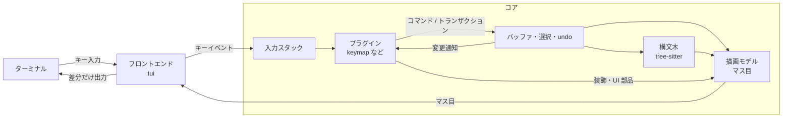

# アーキテクチャ

> ステータス: 合意済み（2026-09-25）

[vision.md](vision.md) の方針を、コアの構造に落とし込む。プラグイン API の具体的な形（WIT）は plugin-api.md で決める。

## 全体像

nib は 1 つのプロセスで動く。プラグインは wasmtime の上で、同じプロセス内のサンドボックスとして動く。外部プロセス（LSP サーバーなど）は、プラグインの依頼を受けてコアが起動する。



## クレート構成

| ディレクトリ | クレート | 役割 |
|--------------|----------|------|
| `core/` | `nib-core` | バッファ、選択、トランザクション、undo、構文木、描画モデル、コマンド、プラグインホスト |
| `tui/` | `nib-tui` | ターミナルとの入出力。実行ファイル `nib` を作る |
| `plugins/*` | `nib-plugin-*` | 標準プラグイン（`wasm32-wasip2` 向け） |

`nib-core` はターミナル関連のクレート（crossterm など）に依存しない。「何を表示するか」と「どう描くか」の分離を、クレートの依存関係で強制するため。

システムのクリップボードも同じ考え方で分ける。コアはプラグイン向けの API と、読み書きの口（`Clipboard` トレイト）だけを持ち、実際の読み書きはフロントエンドが渡す。tui は `arboard` で OS のクリップボードを読み書きする。フロントエンドが渡さないとき（テストなど）は、エディタの中だけのクリップボードを使う。SSH 越しの端末（OSC 52 でコピーする）は、フロントエンドの実装を足せば対応できる。

プラグインホスト（wasmtime）は、まず `nib-core` のモジュールとして持つ。ビルド時間が問題になったら別クレートに分ける。

## データモデル

### バッファ

- テキストは rope で持つ（ropey を想定）。複製が O(1) なので、後述の非同期処理にスナップショットを渡しやすい。
- UTF-8 のみ扱う。改行コード（LF / CRLF）は読み込み時に判定し、保存時に元に戻す。
- ファイルの読み込みと保存はコアの仕事。プラグインは `buffer.save` のようなコマンドを呼ぶだけで、ファイル権限は要らない。
- 保存は、同じディレクトリの一時ファイルに書いてから元のファイルと置き換える。書き込みの途中で落ちても元のファイルは壊れない。パーミッションは引き継ぎ、シンボリックリンクはリンク先を書き換える。ハードリンクは切れて、別のファイルになる。

### 位置

- 位置は **UTF-8 のバイトオフセット** で表す。tree-sitter がバイト単位で位置を扱うことと、Rust や Go など多くの言語で文字列の中身が UTF-8 のバイト列であることが理由。
- 文字の途中を指す位置は、コアが拒否する。
- 選択の端は、常に書記素クラスタ（見た目の 1 文字）の境界にあることをコアが保証する。

### 選択

- 選択は Helix と同じく、複数の範囲の集合で持つ。各範囲は `anchor` と `head` を持ち、`head` がカーソルの位置になる。常に 1 つ以上あり、そのうち 1 つを主選択とする。
- 前向きの範囲（`anchor < head`）では、`head` は最後の書記素の直後を指すので、カーソルはその書記素の上に描く（Helix と同じ）。
- 選択はビューごとに持つ。同じバッファを 2 つの分割で開けば、選択も 2 組になる。
- vim 風の「カーソルだけ」の編集モデルは、幅 1 の選択として表す。**コアはモード（ノーマル・挿入など）を知らない。** モードはキーマッププラグインの内部状態で、コアに伝えるのはカーソルの形のような表示に必要な情報だけ。

### トランザクション

- バッファへの変更は、すべてトランザクション（変更の集合と、変更後の選択の組）として適用する。コアもプラグインも同じ道を通る。
- トランザクションは、作られた時点のバッファのバージョンを持つ。バージョンが古い場合は拒否する。LSP の整形結果のように、計算中にユーザーが編集した場合は捨てて構わない。
- 1 つのトランザクションはまとめて適用され、途中の状態を他のプラグインが見ることはない。

### undo

- 履歴はコアが持つ。どのプラグインの変更も、同じ履歴で取り消せるようにするため。
- まずは線形の履歴で始める。Helix のような undo ツリーは後で検討する。
- どこを 1 回の undo 単位にするかはプラグインが決める。たとえば挿入モードに入ってから出るまでを 1 単位にする。

### 装飾

- プラグインは、バッファ上の範囲に装飾（ハイライト、下線、行内に差し込む文字列、行頭の記号）を付けられる。
- 装飾の位置は、編集に合わせてコアが自動で動かす（Neovim の extmark に相当）。診断結果を出すプラグインは、編集のたびに位置を計算し直さなくてよい。
  - 範囲の始まりに挿入した文字は装飾の外、終わりに挿入した文字も外になる。装飾が勝手に広がらないようにするため。
  - 範囲の中身がすべて消えた装飾は取り除く。
  - undo と redo でも、同じように動かす。
- 装飾はバッファが持ち、プラグインと名前空間ごとにまとめて差し替える。1 つのプラグインが、用途ごと（括弧の対応、検索結果など）に別々に更新できる。
- 描画では、構文ハイライトの上に装飾を重ね、その上に選択の背景色を重ねる。装飾のスタイルは、指定のある項目（文字色、背景色、太字など）だけを上書きする。
- M2.3 で作るのは範囲のスタイルだけ。行内に差し込む文字列（inlay hint）、行末の文字列、行頭の記号は、使い道の LSP と一緒に M3 で作る。行内の文字列は縦移動やスクロールの桁の計算に関わり、行頭の記号は本文の幅を変えるので、使う場面が揃ってから形を決める。
- M3.4 で、行末の文字列（注記）を足す。LSP の診断のメッセージに使う。行の末尾より後ろにだけ描くので、カーソルの位置や桁の計算には関わらない。1 行に複数あれば、並べて描き、入らない分は切る。

## 構文木

- tree-sitter の解析はコアが行う。編集のたびに、トランザクションの変更範囲を使って差分で解析し直す。
  - 1 つのトランザクションの変更は、全体を覆う 1 つの編集として構文木に伝える。複数カーソルで離れた場所を編集すると解析し直す範囲が少し広がるが、途中の状態のテキストで位置を数えずに済む。
  - undo と redo では構文木を捨てて全体を解析し直す。
  - 解析するのは表示中のバッファだけ。隠れているバッファは、表示したときに解析する。
- 文法は WASM 形式のものをプラグインが提供し、ハイライトなどのクエリ（`.scm`）も同じプラグインが持つ。
  - 言語だけを提供するプラグインは、コードを持たない「データだけのプラグイン」にできる（`plugin.wasm` がなく、`plugin.toml` の `[[languages]]` に文法とクエリのファイルを書く）。
  - クエリは `[languages.queries]` に名前とファイルを並べる。`highlights` と `injections` はコアが使い、ほかの名前（`textobjects` など）はプラグインが API で使う。コアが名前を知らないクエリも置けるので、新しい種類のクエリを使うプラグインのためにコアを変えなくて済む。

```toml
[[languages]]
name = "rust"
file-types = ["rs"]
grammar = "tree-sitter-rust.wasm"

[languages.queries]
highlights = "queries/highlights.scm"
textobjects = "queries/textobjects.scm"
```
  - WASM の文法は tree-sitter の `wasm` 機能で読み込む。この機能は wasmtime の C API を使うので、nib の wasmtime は tree-sitter が使うバージョンにそろえる（2 つの wasmtime を抱えないため）。C API のビルドには cmake が要る。
  - 文法用の wasmtime のエンジンは、プラグイン用とは別に作る。tree-sitter のストアは epoch による中断を想定していないため。コンパイル結果のキャッシュは共有する。
- 文法とハイライトのクエリは、そのファイル形式を初めて表示したときに読み込む（キャッシュがあっても約 17 ms かかるため）。クエリのコンパイル（Rust のハイライトで 13 ms。tree-sitter はコンパイルしたクエリを保存できない）は別のスレッドで行い、最初の解析と並べる。ファイルを開いた直後の解析も最初の画面のあとに回し、まず色なしで表示してから色を付ける。打鍵のあとの差分での解析はその場で行う。
- ハイライトは表示中の範囲だけにクエリを実行する。構文の種類が重なったときは内側を優先し、同じ範囲ではクエリに先に書かれたパターンを優先する（tree-sitter のハイライトの慣習）。色は構文の種類の名前（`keyword`、`function.method` など）でテーマから引き、見つからなければ `.` の前へさかのぼる。
- ある言語の中の別の言語（Markdown のコードブロック、Rust のドキュメントコメントなど）は、injection として扱う。
  - 言語プラグインの `injections` クエリが、どこをどの言語で読むかを決める。書き方は tree-sitter の慣習に従う: `@injection.content` の捕獲、言語名を持つノードの `@injection.language` か `#set! injection.language`、`#set! injection.combined`（同じパターンのマッチを全部つないで 1 つの文書にする）、`#set! injection.include-children`（書かなければ、名前つきの子のノードの範囲を除く）。
  - 言語名は、言語の `name` か `file-types` のどれかで引く（`rust` でも `rs` でもよい）。`rust,ignore` のような情報文字列は、最初の語だけを見る。見つからない言語は色を付けない。
  - 見つけた範囲ごとに、その範囲だけを解析する層（tree-sitter の included ranges）を作る。層の中にも injection があれば、4 段まで入れ子にする（Rust → ドキュメントコメントの Markdown → そのコードブロックの Rust → …）。
  - ハイライトは、元の言語の色の上に層の色を重ねる。層の色は層の範囲の中だけに塗る（ドキュメントコメントの `///` には塗らない）。
  - 編集のたびに、クエリは構文木が変わった範囲と編集した範囲にだけ掛け直し、ほかは前回の結果を位置だけずらして使う。3,455 行の Rust ファイルでは、全体に掛けると 1 回 3 ms かかるため。組み立て直すのも、見つけたものが変わった層だけにする。層は、中の文字が変わっていなければそのまま使い、変わっていれば古い構文木から差分で解析し直す。層の範囲が編集なしに増減したとき（コメントがドキュメントコメントになったなど）は、その範囲を同じ長さの編集として古い構文木に伝えてから解析する。tree-sitter は編集の届かない部分を古い構文木から使い回すので、伝えなければ新しい範囲を読まない。
  - 層の構文木は、画面の近くのものだけが持つ。Markdown は段落や見出しごとに行内の層があり、大きなファイルでは数千になるため。打鍵のときは画面に見えている層を解析し、描画のあと（キーを待つ前）に上下 1 画面分を先読みする。上下 4 画面より外に出た層は構文木を捨て、編集も伝えない。見つけた範囲は全部について覚えておき、位置だけずらす。
  - ファイルを開いた直後の最初の解析では、injection を探すのをもう一度あとに回す。元の言語の色を先に付けてから、層の色を付ける。
  - 言語を読み込んだら、開いているバッファを解析し直す。新しい言語の injection があるかもしれないため。
- プラグインは API を通じて、構文ノードの検索やクエリの実行ができる（[plugin-api.md](plugin-api.md) の「構文木」）。テキストオブジェクト（「関数を選択」など）はこれで実現する。
  - プラグインが構文木を読むときは、その場で解析を最新にしてから答える。プラグインは解析の時機を気にしなくてよい。
  - `highlights` 以外のクエリは、初めて使われたときにコンパイルする。

## コマンド

- コマンドは名前つきの操作（例: `buffer.save`、`helix.move_next_word`）で、コアとプラグインの両方が登録できる。
- プラグイン同士はコマンドの名前を通じて連携する。たとえば LSP プラグインが `lsp.definition` を登録し、キーマッププラグインがそれを `gd` に割り当てる。プラグインが互いの中身に依存しないで済む。
- 引数と戻り値の形式は plugin-api.md で決める。

## 入力

- フロントエンドは、端末から受け取ったキーを、端末の種類に依存しない形（キーと修飾キーの組）に直してコアに渡す。kitty keyboard protocol が使える端末では使う。
- **Ctrl-g はコアの予約キー**で、プラグインには渡さない。押すと、コアがプラグインを介さずに**コアメニュー**を出す。
  - 主な目的はプラグインの管理。読み込んでいるプラグインの一覧（状態、遅い呼び出しの回数、失敗の理由）を見て、選んだプラグインの再起動、無効と有効の切り替え、ディスクからの読み直しができる。
  - あわせて、全部保存して終了と、終了ができる。未保存の変更があるときの終了には、確認を 1 段はさむ。
  - Ctrl-g はプラグインに一切届かない。キーマップで Ctrl-g を使いたい場合は、`[core]` の `menu-key` で予約キーを別のキーに変える。
  - 予約するのはこの 1 つだけにし、ほかの機能はすべてメニューの奥に置く。予約キーを増やすほど、キーマップとぶつかるため。
  - 操作は 1 キーずつにし、押せるキーは常に画面に出す。Esc で 1 段戻る。
- 予約キーを持つのは、キーマップが壊れていても、キーを飲み込むバグのプラグインがいても、必ずプラグインを管理できるようにするため。OS の Ctrl-Alt-Del と同じく、アプリ（プラグイン）には横取りさせない。
- Ctrl-g を選んだ理由:
  - Helix の既定の配置で使われていない。ほかのキーマップの利用者にもぶつかりにくい。
  - Emacs の C-g（実行中の処理の中断）と意味が重なる。端末の入力を別スレッドで読むようになったら（M3）、プラグインの呼び出し中に Ctrl-g を押して、その呼び出しを即座に止められるようにする。
  - 最初の案の Ctrl-q は Ctrl-w の隣にある。Helix でよく使う `Ctrl-w q` を打ち間違えると「メニューを開いて q」になり、未保存の変更を失いかねない。また Helix のウィンドウモードで `Ctrl-w Ctrl-q` に使われている。
  - どの端末でも 1 バイトで届く。Alt（macOS の Option が文字になる）、F キー、Ctrl-Space（macOS の入力ソースの切り替え）、kitty keyboard protocol が要る組み合わせは、確実に届かないので候補から外した。
- 予約キーは `[core]` の設定で利用者だけが変えられる。プラグインからは変えられない。
- キーマッププラグインがすべてのキーを受け取るので、画面から予約キーを知る手段がない。そこで起動時に、最初のキーを押すまで「Ctrl-g: plugin menu」と表示する。
- それ以外のキーは、**入力スタック**の上から順に渡す。
  - いちばん下はキーマッププラグイン。
  - ファイル選択のようにキーを専有したいプラグインは、スタックに自分を積む。
  - 受け取ったプラグインが「処理しない」と返せば、下に回す。
- キー入力はすべてプラグインを経由するが、WASM の関数呼び出しは数マイクロ秒程度なので、遅延は問題にならない想定。実装後に測って確かめる。

## 描画

### 描画モデル

- コアは画面を**等幅文字のマス目**として組み立てる。各マスは文字（書記素クラスタ）とスタイル（前景色、背景色、太字など）を持つ。全角文字は 2 マスを使う。
- 組み立てに使うのは次のもの。
  - 表示範囲のテキスト
  - 構文ハイライト
  - プラグインが付けた装飾
  - UI 部品（後述）
  - カーソルの位置と形
- フロントエンドは、前回のマス目との差分だけを端末に書き出す。
- 書記素の分割や幅の計算は、表示中の行だけで行う。ASCII どうし（`\r\n` を除く）は必ず別の書記素で幅も 1 なので、Unicode の表を引かずに進める。コードの画面の組み立ての 4 割が、この表引きだった。
- 前の画面との差分は、行ごとに比べて、変わった行だけをマスごとに見る。

### 分割表示

- 画面の本文の部分を、ビューで分ける。分け方は木で持つ。節は「左右に並べる」か「上下に重ねる」で、葉がビュー。同じ節の子は大きさを等分する。
  - 左右のあいだには縦線を 1 列、上下のあいだには区切りの行を 1 行描く。区切りの行には、上のビューのファイル名を出す。ステータスラインは画面の下に 1 本だけで、フォーカスしているビューのことを出す。
- 入力を受けるのは、フォーカスしているビュー 1 つ。カーソルもそのビューにだけ描く。ほかのビューの選択は、色だけ付ける。
- 同じバッファを 2 つのビューで開いていれば、片方での変更（undo と redo を含む）に合わせて、もう片方の選択も動かす。隠れているビューの状態（`gn` などで戻ったときに使う）も同じく動かす。
- 分割、閉じる、フォーカスの移動はコアのコマンドにする。キーマッププラグインはそれを呼ぶだけ。

| コマンド | 引数 | 動作 |
|----------|------|------|
| `view.split` | `{"direction": "vertical" \| "horizontal"}` | フォーカスしているビューを左右（vertical）か上下（horizontal）に分け、新しいほうにフォーカスを移す。新しいビューは同じバッファ、同じ選択、同じスクロール位置で始まる |
| `view.close` | | フォーカスしているビューを閉じる。最後の 1 つは閉じられない |
| `view.only` | | ほかのビューをすべて閉じる |
| `view.focus` | `{"to": "next" \| "left" \| "right" \| "up" \| "down"}` | フォーカスを移す。方向のときは、その向きで隣り合うビューへ |

- プラグインの `editor.active-view` は、フォーカスしているビューを返す。フォーカスしていないビューを直接さわる API は、使い道が出てきたら足す。

### プラグイン API に画面の座標を出さない

プラグインが扱うのは、バッファ上の位置と、抽象的な UI 部品だけにする。「画面の何行目・何列目」は API に出さない。配置と切り詰めはコアが行う。こうしておけば、分割のレイアウトを変えても、あとから GUI を足しても、プラグインを書き直さずに済む。

### UI 部品

コアが用意する部品は、まず次の 3 つに絞る。

| 部品 | 用途の例 |
|------|----------|
| ステータスライン | モード表示、ファイル名、診断の件数。プラグインが左・中・右に区切った文字列を渡す |
| ポップアップ | 補完候補、ホバー、キーの候補。バッファ上の位置か、本文の右下の角に結びつけて表示する |
| パネル | コマンドライン、ファイル選択。画面の下端など決まった場所に出す |

中身は、どれもスタイルつきの行の並びとして渡す。

ポップアップは本文の上に重ねて描き、カーソルは取らない。

- 位置に結びつけたものは、その位置の行の下に出し、下に入らなければ上に出す。右端からはみ出すなら左にずらす。その位置が画面の外にあるあいだは出さない。
- 位置は編集に合わせて動かさない。補完やホバーは短命なので、動かしたければプラグインが作り直す。
- 右下の角のものは、Helix の `g` などで出るキーの候補の表示に使う。

### テーマ

プラグインは色を直接指定せず、`ui.statusline` や `diagnostic.error` のような名前で指定する。名前から色への対応はテーマが決める。

- 組み込みのテーマは端末の 16 色で書き、端末の配色に合わせて見え方が変わるようにする。
- config.toml の `[theme]` で、名前ごとに上書きできる。色だけを書けば文字色、表なら `fg` `bg` `bold` `italic` `underline` `reverse`。色は 16 色の名前、`#rrggbb`、0〜255、`default`。
- 名前が見つからなければ `.` の前へさかのぼる（`function.method` → `function`）。
- 構文の色は描画のたびにテーマから引くので、テーマの変更はすぐに反映される。

## プラグインの実行

### 1 本のスレッドで順に処理する

- エディタの状態（バッファ、選択、プラグインのインスタンス）に触れるのはメインスレッドだけ。
- I/O（外部プロセスの入出力、ファイルの読み書き、変更の監視）と WASM のコンパイルは裏のスレッドで行い、結果をメインループのキューに入れる。
- メインループは次のイベントを順に処理する。
  - キー入力
  - 外部プロセスの出力
  - タイマー
  - ファイルの変更
- プラグインの呼び出しも同じスレッドで行う。変更の順序が 1 つに決まるので、競合を解決する仕組みが要らない。
- 一連のイベントを処理し終えたら、1 回だけ描画する。
- 次のタイマーの時刻まではキー入力を待ち、時刻になったらタイマーのイベントを配る。タイマーがなければ、キー入力だけを待って眠る。
- 端末からの入力は、入力のスレッドが読んでキューに入れる。外部プロセスの出力を読むスレッドも、同じキューでメインループを起こす。メインループは、このキューとタイマーの時刻だけを待つ。
  - 入力のスレッドがあれば、プラグインの呼び出し中でも Ctrl-g を見られる（M3.5 で、呼び出しを止めるのに使う）。

### 呼び出し中のプラグインへの貸し出し

- プラグインを呼ぶあいだ、コアはエディタの状態とプラグインの一覧（ほかのプラグインのインスタンス）を、そのプラグインのストアに貸す。ホスト関数は、貸されたものだけを通じてエディタに触れる。
- プラグイン A が `commands.call` でプラグイン B のコマンドを呼ぶと、ホスト関数は A に貸されたものを B に又貸しして、B を呼ぶ。終わったら A に戻す。
  - 呼び出し中のプラグインのインスタンスは一覧から抜いてあるので、A が自分自身や、A を呼んだプラグインを呼ぼうとすると見つからない。これを再入のエラーにする。
  - B が落ちたときは、B のインスタンスを捨てて A にエラーを返す。再起動や無効化は、いちばん外側の呼び出しが終わってから行う。呼び出しの途中でプラグインを起動し直すと、貸し借りが入り組むため。
- epoch による時間の上限は、プラグインごとの期限として働く。B の処理時間は A の時間にも含まれる。A は B を待っているため。

vim、Emacs、Kakoune、Neovim も、エディタの状態は 1 本のスレッドで扱っている。プラグインを別スレッドで並行して動かす設計（xi-editor の方式）は採らない。編集の競合を解決する仕組みが必要になり、複雑さに見合わない。

Emacs の daemon や Kakoune のように、1 つのエディタに複数の画面（クライアント）をつなぐ形は、当面は目的外とする。描画モデルを分けてあるので、後から足す余地はある。

### 待たせない

- プラグインは、時間のかかる処理を自分では待たない。外部プロセスの起動やファイル検索はコアに依頼し、結果はあとからイベントとして受け取る。
- LSP プラグインはこの形で書ける。サーバーへの送信をコアに依頼し、応答はイベントで受け取る。
- 重い計算（大量の候補のあいまい検索など）を別スレッドで回す仕組みは、必要になってから考える。rope のスナップショットを渡して読み取り専用で動かす形を想定している。

### 時間と資源の上限

wasmtime の epoch interruption を使い、プラグインの呼び出しに 2 段階の時間制限をかける。epoch はプラグインの呼び出し中だけ 10 ms ごとに進め、呼び出していない間は進めるスレッドを眠らせる。待機中のエディタが時間制限のために起きることはない。

| 段階 | しきい値 | 動作 |
|------|----------|------|
| 警告 | 16 ms | 記録するだけで止めない。遅いプラグインを一覧で確認できるようにする |
| 停止 | 1 秒（初期化は 5 秒） | 呼び出しを中断する |

- 停止のしきい値は、無限ループを止めるためのもの。正常な処理を誤って止めないよう、長めにとる。
- 中断したインスタンスは、内部状態が壊れている可能性があるので再利用しない。新しいインスタンスを作り、初期化からやり直す。短い時間に何度も落ちるプラグインは無効にする。
- 途中で止めて後で再開する方式（時分割）は採らない。止めている間にバッファが変わるので、並行実行と同じ競合の問題が戻ってくる。
- メモリにも上限を設ける（wasmtime の `ResourceLimiter`、既定で 256 MiB）。
- プラグインの標準エラー出力は端末に出さず、メモリに受ける。Rust のプラグインが panic したときは、そこから panic のメッセージを拾ってエラー表示に使う。
- 呼び出しの途中で止まったプラグインは、この時間制限が止める。落ちずにおかしな状態になったプラグイン（キーを飲み込み続けるなど）は、予約キー **Ctrl-g** のコアメニューから再起動や無効化ができる（前述の「入力」）。
- 呼び出し中に **Ctrl-g** を押すと、その呼び出しをすぐに止める。止めたプラグインは、時間切れと同じく再起動する。そのあとでコアメニューが開く。
  - 入力のスレッドは、Ctrl-g を読んだら回数を数えるだけにする。呼び出しは始まったときの回数を覚えておき、それより増えていたら止まる。Ctrl-g の前に押したキーの処理や、Ctrl-g のあとで始まった呼び出しは止まらない。
  - epoch の期限は毎回 1 刻み（10 ms）先にし、期限が来るたびに wasmtime のコールバックで「時間切れか」「Ctrl-g が押されたか」を確かめて、どちらでもなければもう 1 刻み延ばす。上限のない呼び出しも、この確かめで止められる。

### 障害の切り離し

プラグインがトラップ（WASM の実行時エラー）を起こした場合は、そのインスタンスを捨ててエラーを表示する。プラグインがバッファを変えられるのはトランザクション経由だけなので、途中で落ちてもバッファは壊れない。

## 設定とプラグインの管理

### 設定

設定は `~/.config/nib/` に置く（`$XDG_CONFIG_HOME` があればその下、Windows では `%APPDATA%\nib\`）。コアの設定とプラグインの設定を、ファイルで分ける。

```
~/.config/nib/
├── config.toml          # コアの設定（[core]、[theme]）
└── plugins/
    ├── helix.toml       # ファイル名 = プラグイン名
    └── lsp.toml
```

どれも利用者が書くファイルで、プラグインからは変えられない。書き間違いがあっても nib は既定値で起動し、ステータスラインに理由を出す。

#### config.toml

コアの設定は 2 種類に分ける。

| 種類 | 例 | 変えられるのは |
|------|----|----------------|
| 編集の振る舞い | タブ幅、インデント、カーソルの上下に残す行数、テーマ | 設定ファイルとプラグイン |
| 安全装置 | プラグインの時間とメモリの上限、権限、予約キー、読み込むプラグイン | 設定ファイル（利用者）だけ |

- 安全装置までプラグインが変えられると、壊れたプラグインが自分の上限を引き上げたり、予約キーを横取りしたりできてしまう。
- 編集の振る舞いをプラグインに開けることで、`.editorconfig` の読み込みや言語ごとのインデントを、コアを変えずにプラグインとして書ける。
- 値は「設定ファイルの全体の値」を「プラグインがバッファ単位で上書きする」の 2 段だけにする。言語ごとの既定値のような段はコアに持たず、プラグインの仕事にする（標準プラグイン `indent`。[plugin-api.md](plugin-api.md) の「設定」）。

```toml
[core]
tab-width = 4
indent = 4                 # 空白 4 つ。"tab" ならタブ
scroll-margin = 5
menu-key = "C-g"           # 安全装置。プラグインからは変えられない
plugin-timeout-ms = 1000   # プラグインの上限の既定値
plugin-init-timeout-ms = 5000
plugin-memory-mib = 256

[theme]                    # 組み込みのテーマの上書き。UI の部品と構文の種類の名前で書く
keyword = "magenta"
comment = { fg = "bright-black", italic = true }
```

#### plugins/<name>.toml

1 つのプラグインについてのことを 1 ファイルに集める。表の外のキーは nib が読み、`[settings]` はプラグインの `init` に JSON で渡す。

```toml
# ~/.config/nib/plugins/lsp.toml
path = "~/dev/nib-lsp"     # 埋め込み以外は、どこから読むか
enabled = true             # false なら読み込まない。埋め込みのプラグインも同じ
timeout-ms = 2000          # このプラグインだけの上限。書かなければ [core] の値。"none" で上限なし
init-timeout-ms = 5000
memory-mib = 512
load = "lazy"              # 使われるまで起動しない。既定は "start"（起動時に読み込む）

[settings]                 # lsp プラグインに渡す設定
servers.rust.command = ["rust-analyzer"]
```

- ディレクトリに分けるのは、プラグインを足すのも消すのもファイル 1 つで済み、配布物や AI が作ったプラグインが既存のファイルを書き換えずに自分の設定を置けるようにするため（lazy.nvim の `lua/plugins/*.lua` や Kakoune の `autoload/` と同じ考え方）。
- 1 ファイルで見渡せない分は、`nib plugin list` で補う。埋め込みも含めた全部のプラグインを、有効かどうか、どこから読むか、どの設定ファイルに書かれているかと一緒に表示する。
- `path` で読んだプラグインの名前がファイル名と違えば、エラーにする。
- 埋め込みと同じ名前のファイルに `path` を書くと、埋め込みの代わりにそちらを読む（標準プラグインを改造しながら試すため）。
- `timeout-ms = "none"` は、呼び出しの時間に上限を設けない。無限ループに入っても、Ctrl-g で止められる（「時間と資源の上限」）。`init-timeout-ms` にも書ける。
- `load = "lazy"` のプラグインは、読み込んで（コンパイルまでして）おくが、起動（インスタンスを作って `init` を呼ぶ）は使われるときまで待つ。使われるときとは、次のどちらか。
  - そのプラグインのコマンド（`<name>.` で始まる名前）が呼ばれた
  - マニフェストの `events` に書いたイベントが届いた
  - キーは起動のきっかけにならない。キーマップのように入力スタックに層を積むプラグインは、`init` で積むので、lazy にしない。
  - 起動するまで、そのプラグインのコマンドは `commands.all()` に出ない。

インストールしたプラグイン（[plugin-install.md](plugin-install.md)）は `~/.local/share/nib/installed/` に置き、標準プラグインのあとに読み込む。`plugins/<name>.toml` は設定だけを書く場所のままにする。読み込めないプラグインは飛ばして起動し、理由をメッセージで出す。

#### サブコマンド

| コマンド | 動き |
|----------|------|
| `nib config path` | 読んでいる設定ファイルの場所を表示する |
| `nib config init` | 既定値と説明をコメントで書いた `config.toml` と `plugins/helix.toml` を作る。すでにあるファイルは上書きしない |
| `nib plugin list` | プラグインの一覧を表示する |

### プラグインの管理

- 読み込んだプラグインを動かす管理（一覧、有効と無効の切り替え、再起動、ディスクからの読み直し）はコアが持つ。Ctrl-g のメニューとコマンドから使う。
- 言語（文法とクエリ）は設定によらず、そのファイル形式を初めて表示したときに読み込む。
- インストールと更新（git などからの取得、バージョンの解決、更新）はコアに入れない。ネットワークとファイル操作を伴う、エディタ本体とは別の複雑さなので、本体の外で `nib plugin add <url>` のようなサブコマンドとして作る。プラグインの設定ファイルを置くのもそのコマンドの仕事になる。

### プラグインの読み込み

- 標準プラグインは実行ファイルに埋め込み、設定がなくても動くようにする。開発中はディスクから読み込めるようにする。
- config.toml の `[core] plugins` や `nib --plugin DIR` で、埋め込みと同じ名前のプラグインを指定すると、埋め込みの代わりにそちらを読む。標準プラグインを改造しながら試すため。
- 読み込む順は埋め込みが先。キーマッププラグインを入力スタックのいちばん下に置くため。
- ビルドは `cargo xtask` で行う。標準プラグインを `wasm32-wasip2` 向けに先にビルドし、そのあと実行ファイルを作る。Cargo だけでこの順序を書くには不安定機能（`-Z bindeps`）が必要なため。
- WASM のコンパイル結果はキャッシュし、2 回目以降の起動を速くする。キャッシュから読むのも 1 つ数 ms かかるので、起動時のプラグインはまとめてスレッドで読み、登録と起動（`init`）だけを順に行う。

## 性能目標

### 既存エディタの実測値

vim と Helix と nib を同じ条件で測った結果は [benchmarks.md](benchmarks.md) にまとめる。設計を決めたとき（2026-09-25）の値では、3,455 行の Rust ファイルで、打鍵が vim 7.1 ms、Helix 15.8 ms（中央値）だった。

Helix は、プレーンテキストなら打鍵が 0.8 ms だった。ファイルが大きいほど遅くなるので、構文ハイライトの処理量がファイルの大きさに比例していると見られる。nib も tree-sitter をコアに持つので、同じ落とし穴に注意する。構文木の更新は差分で行い、ハイライトのクエリは表示範囲だけに実行する。

### 目標

Helix が小さいファイルで出している速さを、大きいファイルでも出すことを目指す。条件は 3,455 行の Rust ファイルでハイライトありとし、測るのはエディタ内部の時間とする。

| 指標 | 目標 |
|------|------|
| 挿入モードの打鍵 | 中央値 2 ms 未満、p99 8 ms 未満 |
| スクロール | 中央値 2 ms 未満、p99 8 ms 未満 |
| 起動から最初の描画まで（キャッシュあり） | 100 ms 未満 |
| 1 つのプラグインが 1 回のイベントに使う時間 | 1 ms 未満を目安 |

- 同じスクリプトで vim や Helix と比べ続け、結果を [benchmarks.md](benchmarks.md) に残す。
- 巨大なファイル（数百 MB）やバイナリファイルの編集は、目標に含めない。
